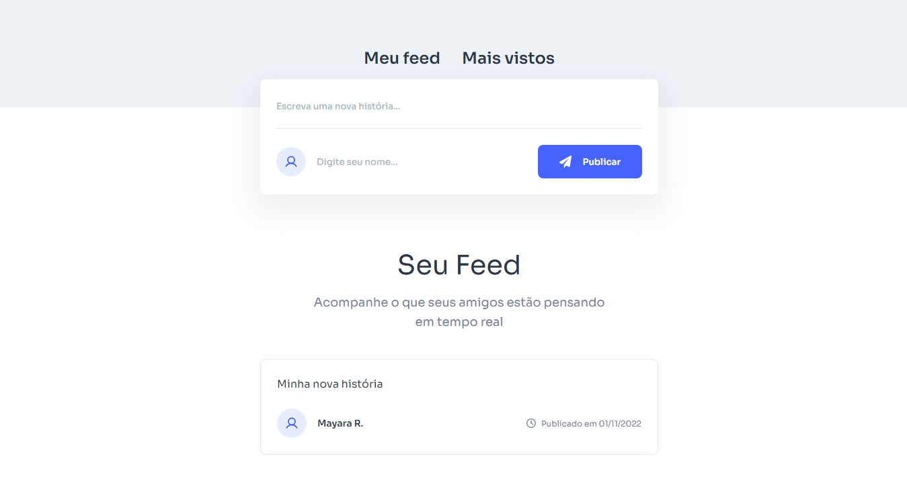

<h1 align="center"> Meu Feed </h1>

Projeto desenvolvido pelo curso de Front-end da <a href="https://app.staart.com/">Staart</a> .

  <a href="#-tecnologias">Tecnologias</a>&nbsp;&nbsp;&nbsp;|&nbsp;&nbsp;&nbsp;
  <a href="#-projeto">Projeto</a>&nbsp;&nbsp;&nbsp;

 

  

## 🚀 Tecnologias

Esse projeto foi desenvolvido com as seguintes tecnologias:

- HTML e CSS
- JavaScript
- [Node e NPM](https://nodejs.org/)
- [React](https://pt-br.reactjs.org/)

## 💻 Projeto

O Meu Feed é um componente que simula o formulário de preenchimento de postagens (publicações de redes sociais).